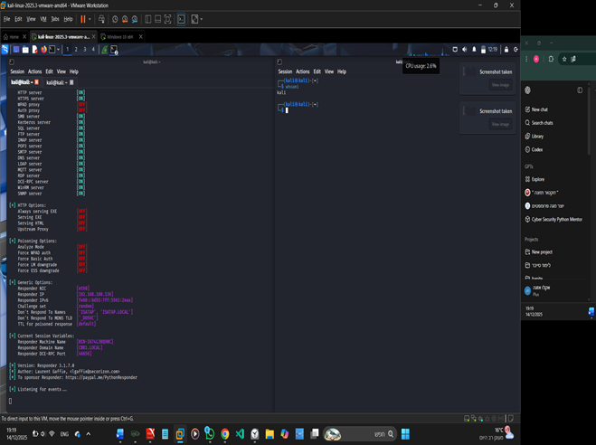

# 🛡️ LLMNR / NBT-NS Poisoning Lab

## 📌 Overview
This project demonstrates a common network attack technique known as **LLMNR/NBT-NS Poisoning**, where an attacker exploits weaknesses in name resolution protocols to capture user credentials (NTLMv2 hashes).

The lab simulates a real-world scenario in a Windows environment and shows how attackers can impersonate legitimate servers on a local network.

---

## 🎯 Objective
- Understand how LLMNR and NBT-NS protocols work
- Demonstrate how attackers exploit these protocols
- Capture NTLMv2 hashes using a controlled lab environment
- Analyze the attack using network traffic (Wireshark)
- Provide mitigation strategies

---

## 🧠 Background

### 🔹 LLMNR (Link-Local Multicast Name Resolution)
- Used when DNS fails
- Uses UDP port 5355
- Multicast address: 224.0.0.252
- No authentication mechanism

### 🔹 NBT-NS (NetBIOS Name Service)
- Legacy protocol for name resolution
- Uses UDP port 137
- Broadcast-based
- No identity verification

⚠️ Both protocols trust the **first response received**, making them vulnerable to spoofing attacks.

---

## ⚠️ Vulnerability Explanation

The attack is possible due to:
1. Lack of authentication
2. Legacy design assumptions (trusted network)
3. Race condition (first response wins)

As shown in the lab, an attacker can impersonate a legitimate server and trick the victim into sending authentication data.

---

## 🔬 Lab Setup

| Role | Description |
|------|------------|
| Attacker | Kali Linux (Responder tool) |
| Victim | Windows machine |
| Network | Same local network |

---

## ⚔️ Attack Flow (High-Level)

1. Victim tries to access a non-existing resource (e.g. \\fake-server)
2. DNS fails
3. System falls back to LLMNR/NBT-NS
4. Attacker responds first pretending to be the server
5. Victim trusts attacker
6. NTLM authentication process starts
7. Attacker captures NTLMv2 hash

---

## 📊 Evidence (Wireshark Analysis)

- DNS failure observed
- LLMNR multicast requests detected
- Multicast IP: 224.0.0.252
- Attacker response seen from local IP
- NTLM authentication exchange captured
-  

### Responder Attack

### Wireshark Analysis

---

## 🛡️ Mitigation

To reduce the risk:

- Disable LLMNR via Group Policy (GPO)
- Disable NetBIOS where possible
- Use strong DNS configuration
- Implement network segmentation
- Monitor for suspicious LLMNR/NBT-NS traffic

---

## 🧠 Key Takeaways

- Legacy protocols introduce real risk
- Internal network ≠ trusted network
- Attackers exploit misconfigurations and fallback mechanisms
- Detection and hardening are critical

---

## 📚 References

- RFC 4795 – LLMNR
- RFC 1001 / 1002 – NetBIOS
- Microsoft NTLM documentation

---

## ⚡ Author

Akalo (akaloCyber)  
Aspiring SOC Analyst | Blue Team
